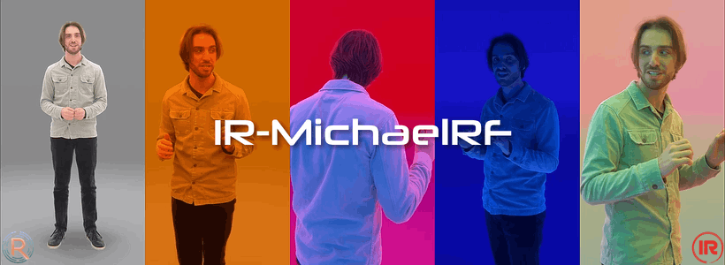

<p align="center">
  
</p>

<p align="center">
  <a href="https://github.com/Infinite-Realities-Research/IR-Datasets" target="_blank">Infinite-Realities Datasets Repository</a>
  | <a href="https://infinite-realities-research.github.io/IR-Datasets/" target="_blank">Project Page</a>
  | <a href="https://docs.google.com/forms/d/e/1FAIpQLScxM9nBuaO5MZf7Gk1IY7hCowU4Kd-yREfCN5JNxlZPiqgOOA/viewform?usp=header" target="_blank">Access Request Form</a>
 <br>
 <a href="https://www.ir-ltd.net/" target="_blank">Website</a>
  | <a href="https://www.youtube.com/@infiniterealities4D" target="_blank">YouTube</a>
  | <a href="https://radiancefields.com/" target="_blank">Radiance Fields Website</a> 
</p>

## Description
Infinite-Realities presents a 30-second long 60fps recording of a presentation delivered by Michael Rubloff from [radiancefields.com](https://radiancefields.com/) captured in the [AeonX: DƐUS motion scanning system](https://www.ir-ltd.net/ir/deus/).

The setup for this capture comprises of 176 [ximea](https://www.ximea.com/) 12 MP machine vision cameras and 484 [Ida-Tronic](https://ida-tronic.com/) Photon LED lights with RGB (red, green, and blue) filters.

The lighting was programmed to change every 6 seconds (360 frames) going through the following states: GI (global illumination), Blade Runner 2049 Orange, Neon Red, Enchanting Aqua, and RGB Normals.


## Dataset Details
This dataset contains the following:

- 1800 frames pre-registered as COLMAP Pinhole model format with undistorted images
- 1800 Gaussian Splat .ply frames trained as individual frames, cleaned with the background and floor removed
- Synchronized Audio .wav file

https://github.com/user-attachments/assets/d0e27295-48b7-46c6-9605-014406dbad66

## IR-Spatial-Humans Desktop/VR Demo

https://github.com/user-attachments/assets/e0b6a896-c6d4-4a4a-83e4-208202a25982

<p align="center">
  <em>Renders from the real-time <strong>IR-Spatial-Humans</strong> Desktop/VR demo showcasing the captures as a flipbook sequence of 3D Gaussian Splats</em>
</p>

<p align="center">
  <a href="https://youtu.be/tc9hOoODfW8" target="_blank">Watch the full demo</a> 
  | <a href="https://docs.google.com/forms/d/e/1FAIpQLSd2nKcMQvv60LIaizlYrRzMcOTcT5in6-4Bj7YSrag9GNydRQ/viewform?usp=dialog" target="_blank">Download the interactive demo</a>
</p>

The **IR-Spatial-Humans** demo can be run in Desktop mode or VR mode from the same app. For VR, it's recommended to use the Meta Quest Link app and a Quest 3; the demo cannot be run standalone on the headset. Please read the included readme for more information.

*This Desktop/VR demo contains an early version of the trained .ply files. The new dataset release was trained with images from an updated image pipeline and newer training method.*

## License and Access

This dataset is released under the terms specified in the [LICENSE.md](LICENSE.md) file. Please review the license before using the dataset.

To request access to the Infinite-Realities Datasets, you must agree to the license terms and complete [this form](https://docs.google.com/forms/d/e/1FAIpQLScxM9nBuaO5MZf7Gk1IY7hCowU4Kd-yREfCN5JNxlZPiqgOOA/viewform?usp=header).

## Citation

If you use our datasets in your research, please cite [Infinite-Realities Datasets](https://github.com/Infinite-Realities-Research/IR-Datasets) and the specific sub-dataset below:


```bibtex
@misc{ir2025datasets,
    author = {Infinite-Realities and Triplegangers and Perry-Smith, Lee and Pearce, Henry and Tomchuk, Oleksandr and Tomchuk, Kateryna},
    title = {Infinite-Realities Datasets},
    year = {2025},
    publisher = {Infinite-Realities},
    note = {GitHub repository},
    howpublished = {\url{https://github.com/Infinite-Realities-Research/IR-Datasets}}
}

@misc{ir2025michaelrf,
    author = {Infinite-Realities and Perry-Smith, Lee and Pearce, Henry and Rubloff, Michael},
    title = {IR-MichaelRF},
    year = {2025},
    publisher = {Infinite-Realities},
    note = {Part of the Infinite-Realities Datasets repository},
    howpublished = {\url{https://github.com/Infinite-Realities-Research/IR-MichaelRF}}
}
```

If you use any images or videos from the dataset in your research publication, please include proper attribution and refer to the [press kit](https://github.com/Infinite-Realities-Research/IR-Datasets/blob/main/press-kit.md) for guidelines on usage.